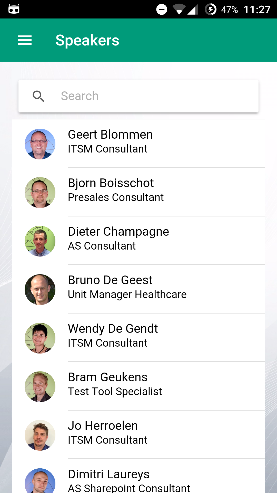

# II. Technisch

## 2.1 Technologie en tools

#### 2.1.1 Technologie

* **TypeScript:**

TypeScript is een *typed superset* van JavaScript, ontwikkeld door Microsoft.  De *superset* zorgt ervoor dat we extra functionaliteiten kunnen gebruiken zoals types, klassen, interfaces en meer. Het wordt gemakkelijker en overzichtelijker om te programmeren, omdat er duidelijk object-geori&euml;nteerd gewerkt kan worden.
TypeScript wordt *getranspiled* naar JavaScript, wat wil zeggen dat de uiteindelijke code die uiteindelijk gebruikt wordt nog steeds JavaScript is. Het is mogelijk om TypeScript voor zowel server-side als client-side  programmeren te gebruiken.

* **Angular 2:**

Angular 2 is een open source JavaScript *framework*, ontwikkeld door Google, dat gebruikt wordt om web based applicaties te maken met HTML, CSS en JavaScript. Het is een opvolging van AgularJS die in januari 2016 in beta kwam. Rond het einde van de stageperiode, 2 mei om precies te zijn, is de release candidate van Angular 2 uitgekomen. Het wordt ondersteund door JavaScript, TypeScript en Dart.

* **Ionic 2:**

Ionic 2 is een mobile app framework dat gebruik maakt van HTML, CSS (of Sass) en Javascript om hybride applicaties te ontwikkelen. Oorspronkelijk waren deze applicaties enkel beschikbaar op Android en iOS, maar sinds kort zijn ze ook beschikbaar voor Windows Phone. Ionic 2 is gebouwd op [Angular 2](https://angular.io/) en de [Cordova](https://cordova.apache.org/) plug-in. Cordova is het element in Ionic dat voor toegang zorgt tot native device API's zoals een qr-code scanner. Het ziet er toe dat de applicaties beschikbaar zijn op platformen zoals Android, iOS en Windows Phone.

Bij aanvang van het project was Ionic 2 nog in alpha. Gedurende de hele stageperiode zijn er aanzienlijk veel veranderingen gebeurd, sommige groter dan andere. Het valt op hoeveel de documentatie over Ionic 2 is aangevuld op de webpagina. De veranderingen die het development team van Ionic doorvoerde moesten vaak ook in de Experience Day app aangepast worden. Tegen het einde van de stageperiode kwam Ionic 2 ongeveer in beta.7.

In dit project worden er veel componenten van Ionic 2 in de view gebruikt. Knoppen, verschillende soorten lijsten, menu's, ... zijn voorbeelden van deze componenten. Hier hangt op een Angular 2-wijze functionaliteit aan in hun componenten. Die functionaliteit wordt geschreven in TypeScript.

Ionic 2 komt met de Ionic CLI. Een belangrijk Ionic-commmando dat van pas is gekomen in het project is `ionic serve --lab`. Dit zorgt er voor dat een view wordt weergegeven van de ge&iuml;nstalleerde platformen in een browser. `ionic serve` runt de applicatie op de lokale machine. `--lab` opent het zogenaamde Ionic Lab. Zo kunnen we het design voor Android en iOS tegelijk in het oog houden.

Het is ook mogelijk om met `ionc serve` de applicatie te runnen en in mobiele vorm weer te geven. Dit kan in de Chrome dev tools (F12) linksboven op het mobile logo te klikken. Boven het design is er een mogelijkheid om de resolutie van verschillende smartphones te testen. 

* **Sass**

Sass is een CSS extension language die toelaat om onder andere gebruik te maken van variabelen en functies binnen de styling. SassScript is de scriptingtaal die gebruikt wordt en later vertaald naar CSS. Deze 'vertaling' gebeurt op vergelijkbare wijze als de *transpilation* van TypeScript naar JavaScipt.  

* **LokiJS**

LokiJS is een in-browser NoSQL database die een goede band heeft met Cordova en Node.js. NoSQL wil zeggen dat er niet-relationeel te werk wordt gegaan. De bestanden worden net zoals bij MongoDB opgeslagen in JSON-formaat. LokiJS is aantrekkelijk vanwege zijn performantie, eenvoud in gebruik en meer. 
LokiJS wordt in de Experience Day app vooral gebruikt voor de resultaten van de evaluatieformulieren op te slagen.

#### 2.1.2 Tools 

* **[Team Foundation Server](https://www.visualstudio.com/en-us/products/tfs-overview-vs.aspx)** of **TFS** werd gebruikt voor source code management (git flow), requirements en projectmanagement.

* **[SourceTree](https://www.sourcetreeapp.com/)** als git client.

* **[Webstorm IDE](https://www.jetbrains.com/webstorm/specials/webstorm/webstorm.html)** deze komt zeer goed van pas vanwege zijn IntelliSense bij het OOP binnen TypeScript.

* **[Brakcets](http://brackets.io/)** is een comfortabele werkomgeving vanwege het gemak waarmee deze te customizen valt. 

* **[Visual Studio Code](https://code.visualstudio.com/)** is handig door zijn IntelliSense. Dit komt van pas binnen het TypeScriptaspect en is dus een goed alternatief voor WebStorm.

* **[De Ionic Conference App](https://github.com/driftyco/ionic-conference-app)** gebruikt niet alleen de nieuwste releases en veranderingen binnen Ionic 2 en Angular 2, maar is ook een conferentie applicatie. Beide aspecten komen goed van pas aangezien de XPDay App ook een conferentie app is en we dus eenvoudig up-to-date kunnen blijven door deze als referentie te gebruiken.

* **[Beyond Compare](http://www.scootersoftware.com/)** is een handige tool die je volledige mappenstructuren en hun inhoud laat vergelijken op een overzichtelijke manier. Hierdoor kunnen we bij updates van Ionic 2 en/of Angular 2 eenvoudig de essenti&euml;le veranderingen overnemen.

* **[De Ionic Components](http://ionicframework.com/docs/v2/components/)** documentatie geeft een handig overzicht over hoe je de Ionic componenten kan toepassen.

* **[Ionic View](http://view.ionic.io/)** samen met [Ionic.io](https://apps.ionic.io/apps). Ionic View is een mobiele applicatie die toestaat je Ionic apps te runnen op je mobile device. Op het einde van de Readme.md van het project (hieronder in feature/DevEnvironment) wordt beschreven hoe een project ge&uuml;pload kan worden naar Ionic.io. Bij het uploaden van een nieuwe app of een nieuw project, wordt er een specifieke ID aangemaakt waarmee men dan later kan connecteren via de Ionic View App.

    * **Om de Experience Day App v2 te bekijken op je mobile device:**
        * Download de Ionic View App via de App Store of Google Play.
        * Klik op de 3 bolletjes.
        * Klik op *'Preview an app'*
        * Hier krijg je een textbox waar je een ID kan invoeren. XPDay App ID: ** d3868646 **
        * Klik op *'Load App'* om de applicatie te bekijken.
        * Er wordt regelmatig een nieuwe versie ge&uuml;pload, om steeds met de laatste versie mee te zijn klik je op de app klik je op *'Sync to latest'*

* **CTG Sharepoint** werd onder andere gebruikt voor bestandsuitwisseling en contact.

## 2.2 Ontwikkeling

#### 2.2.1 Inleiding

De Experience Day App is ontwikkeld met de scrum methode. Dit is een gepaste werkwijze gezien de situatie, vanwege het gebrek aan informatie en expliciete vereisten (zie *[1.3 Opgave](../Introductie/README.md#opgave)*). Het laat plaats voor een bepaalde flexibiliteit bij het opstellen van de vereisten. Er werd gemikt op een werking met sprints opgedeeld in twee weken.

Meestal wordt er bij scrum gewerkt met teams. Door het gebrek aan beschikbare medewerkers vanwege een drukke agenda, is er in deze stage echter gewerkt in een team van &eacute;&eacute;n persoon. Weliswaar onder toezicht van de stagementor. Toch is de scrum methode handig om een overzicht te behouden van het werk en om ervaring op te doen in het gebruik van de methode en bijhorende tools.

#### 2.2.2 Onderzoek

In dit project wordt er gewerkt met enkele nieuwe technologieën. Om met deze technologie&euml;n van start te gaan is het handig om een aantal zaken op te frissen en te bestuderen. Aangezien Angular 2 gebruik maakt van TypeScript is het best om eerst TypeScript eens bekijken. Dit kan onder andere op [Pluralsight]( https://app.pluralsight.com/library/courses/angular-typescript/table-of-contents). Aansluitend is de Angular 2 quickstart en de Tour of Heroes tutorial op de [Angular website](https://angular.io/docs/ts/latest/quickstart.html) een goede inleiding om kennis te leren maken met de manier van werken. Ten slotte is de [tutorial voor Ionic 2](http://ionicframework.com/docs/v2/getting-started/tutorial/) ook een aanrader om gevoel te krijgen in de omgeving.

#### 2.2.3 Setup development environment

###### **Team Foundation Server (TFS)**

Vanaf er genoeg features verzameld waren, zijn deze ingevuld op de TFS van CTG. Deze features werden opgesplitst in backlog items, die vervolgens op een kanban-board een praktisch overzicht vormden. Dit board heeft een onderverdeling als volgt: *New* voor nieuwe taken; *Shortlist* voor taken die men als volgende wenst aan te pakken; *In Progress* voor de taken die op dat moment worden aangepakt; *Pending Approval* voor taken die klaar zijn, maar nog een goedkeuring nodig hebben of nog eens nagekeken moeten worden; *Done* voor de taken die klaar zijn. Work items worden in respectievelijke volgorde in deze categorie&eamp; geplaatst, afhankelijk van hun status.

TFS dient niet enkel als scrum tool, maar kan verder ook nog gebruikt worden voor version control. Hierbij wordt de code dus *gecomit* en *gepushed* of ge&uuml;pload naar deze server. Wanneer er een fout in de code zit kan men altijd terugkeren naar een werkende versie door deze terug van de server te halen. Dit gebeurd in het project met het gebruik van Git. Meestal wanneer er een nieuw work item aangepakt werd, werd er met Git een *feature branch* aangemaakt. Zoals het woord 'branch', tak, aangeeft, wordt er dus een zijtak aangemaakt van de *develop branch* (d.i. de hoofdbranch om op te ontwikkelen) waarop dit work item behandeld wordt. Indien er dan een fout in deze branch voorkomt, kan men teruggaan naar een plek op de *develop branch* om deze fout ongedaan te maken. Deze werkwijze beveiligd het project tijdens de ontwikkeling.

###### **Editorconfig en linters**

Zeker wanneer er in een team wordt gewerkt komen de *.editorconfig-file* en *linters* van pas. Ze zijn niet enkel handig voor teams, maar komen ook van pas voor het persoonlijk onderhoud van code. 

* *Editorconfig:*
Het *.editorconfig* bestand staat in de root van het project. Dit bestand zorgt voor een consistentie in programmeerstijlen. Sommige programmeurs gebruiken graag twee spaties voor inspringing gebruikt, gebruiken anderen graag vier spaties. In dit voorbeeld zou er in de *.editorconfig* gedefinieerd kunnen worden dat deze voor iedereen 4 spaties de standaard is. Voor sommige editors is hiervoor een plugin vereist opdat er in de editor een fout wordt gemeld wanneer er niet volgens de regels wordt gewerkt die in de editorconfig zijn gedefinieerd.

* *Lint*
In dit project werd er een *tslint* toegevoegd, eveneens in de rootmap van het project. Dit bestand zorgt ervoor dat eer een foutmelding of een waarschuwing wordt gegeven wanneer er een potentiële fout aanwezig is. In dit geval kijkt het bestand specifiek naar TypScript (ts) regels. Wanneer er dus een typfout gebeurd tijdens het programmeren, zal er een melding waarschuwen dat het programma mogelijks door deze fout crashen.

Deze twee bestanden zorgen voor een bepaald comfort tijdens het programmeren en zorgen mee voor het behoud van nette en leesbare code, ook wanneer er meerdere mensen aan werken. In dit project werden deze toegevoegd voor het geval er mensen bij het project zouden inspringen en omdat ze handig zijn voor zij die het project overnemen.

###### **README.md**

In de README van het project staat een korte samenvatting van de belangrijkste zaken die ge&iuml;nstalleerd moeten worden om het project te kunnen runnen en debuggen. Er wordt hier van uitgegaan dat Node.js reeds ge&iuml;nstalleerd is. Hieronder staan enkele belangrijke te installeren zaken. 

**Belangrijk** is dat deze commands in je terminal of je command prompt uitgevoerd worden in de directory van het project project (vb.: `C:/home/users/yourname/yourIonicProject> npm install` met `yourIonicProject` als naam van het project).

* Packages installeren uit de package.json. In *package.json* wordt er bijgehouden welke zaken belangrijk zijn voor het project. Onderstaande command download en installeert deze opgeslagen packages. Hierdoor moet een nieuw teamlid niet alle packages manueel, &eacute;&eacute;n voor &eacute;&eacute;n,  installeren.

        > npm install

* Om de nieuwste versie van Ionic 2 en Cordova te installeren gebruiken we onderstaande command. Let op de '-g' die aanduidt dat dit globaal ge&iuml;nstalleerd moet worden.
        > npm install -g ionic@beta
        > npm install -g cordova

Deze commands installeren de command line interface tools. `ionic --help` toont alle mogelijke opties voor de ionic CLI tools.

* Dit project is voor beide Android en iOS, dus moeten beide worden toegevoegd. Dit gebeurd als volgt:
        > ionic platform add android
        > ionic platform add ios

Na het uitvoeren van deze command komen ook deze platforms in de *package.json* te staan

* Verder wordt er beschreven hoe de applicatie getest kan worden via de mobiele *Ionic View* app. Excerpt uit de README:

>Installeer de app op het gewenste device via [Google Play](https://play.google.com/store/apps/details?id=com.ionic.viewapp) of de [App Store](https://itunes.apple.com/us/app/ionic-view/id849930087?ls=1&mt=8).  
>Om het project te uploaden naar het [app-platform](https://apps.ionic.io/apps):
>
>       > ionic upload
>
>Indien je al een app hebt aangemaakt op het [platform](https://apps.ionic.io/apps), kan je de id van deze app linken aan het project als volgt: 
>
>        > ionic link <gekopieerde-id-hier>
>        > ionic upload
>Je kan nu de applicatie bekijken op je device.

#### 2.2.4 Navigatie en design

Navigatie in Ionic kan vergeleken worden met een stapel papieren. Wanneer je van pagina A naar pagina B navigeert (`nav.push()`), komt pagina B bovenop pagina A, op de stapel. Wanneer men terug keert wordt B weer van de stapel gehaald (`nav.pop()`). 

Bron: http://blog.ionic.io/wp-content/uploads/2016/03/navigation-push-pop.png

#### Applicatie flow

Deze afbeeldingen zijn schermopnames van de eerst pagina's uit de applicatie. Wanneer de applicatie opent, krijgen we de eerste afbeelding te zien. Dit is de *splashscreen* van de applicatie.

* **Dashboard**

Vervolgens opent de applicatie op de **dashboard** pagina. Hier staat meteen een chronologisch overzicht van de opkomende sessies. Deze kunnen we in een horizontale richting scrollen door te *swipen*. De eerstvolgende sessie is zichtbaar in de eerste tab (met het klokje). De tweede tab toont een overzicht de gehele planning. Hieronder staan vier knoppen: CTG, Venue, Sponsors en Floor Plan. Deze linken door naar een pagina en dienen vooral als template voor als er genoeg informatie bekend is over deze zaken. 

* **Menu**

Linksboven staat een *hamburger menu* icoon. Deze opent de menu van de app waarin we een overzichtelijke weergave zien van de belangrijkste pagina's: Dashboard, Sessions, Speakers, Scanner, Twitter en Login/Logout. Van de menu kan er genavigeerd worden naar deze pagina's. 

* **Menu > Sessions**

Door in de menu op Sessions te klikken komt men terecht bij de Sessions pagina (hierboven links). Hier krijgen we de planning van de Experience Day te zien, onderverdeeld in tijdscategorie&euml;n. Boven alle sessies en onder de toolbar staat een searchbox. Hierin kan er voor specifieke sessies gezocht worden op basis van de titels. 

Bovenaan in de toolbaar staan twee tabs: All en My Sessions. Deze tabs zijn enkel beschikbaar als men ingelogd is. Wanneer men succesvol ingelogd is kan men een persoonlijke agenda samenstellen en deze bekijken in de 'My Sessions' tab. Een sessie toevoegen kan op 2 manieren: 
    * Een sessie favoriten in de Sessions page door een sessie naar links te swipen, waardoor een favorite knop tevoorschijn komt.
    * Een sessie favoriten in de Sessions Detail page (zie verder);

* **Menu > Sessions > Filter**

Rechtsboven in de Sessions pagina staat een settingsknop die bij het klikken een Filter pagina opent. Op deze pagina kan men aanduiden in welke thema's men ge&iuml;nteresseerd is aan de hand van *toggle switches* (schakelaars). De *switches* die aangeduid zijn geven alle sessies weer in de desbetreffende thema's in de Sessions page (de voorgaande lijst met alle sessies).

* **Menu > Sessions > Session detail**

Er is de mogelijkheid om meer informatie te zien over de individuele sessies door hier op te klikken. Zo komt men uit op de screenshot naast de Session page. Deze wordt de Session Detail page genoemd. Hier is de nodige informatie beschikbaar over de sessies, zoals de spreker, begin- en einduur, de zaal waar de sessie zal plaatsvinden, een beschrijving van de sessie en twee knoppen. De eerste knop is een *Favorite button*. Wanneer men ingelogd is kan men een individueel agenda samenstellen door een sessie te *favoriten*. De tweede knop is voor het evaluatieformulier van de sessie. Wanneer er een sessie gefavorite is of een evaluatie compleet is, zal de knop van lay-out veranderen. Verder komt er ook een toast-notification die meldt dat de actie geslaagd is.

Het is verder ook mogelijk om hier op de spreker te klikken en hierover meer informatie te zien op zijn/haar detail pagina.

* **Menu > Sessions > Session detail > Evaluation form**

Een evaluatieformulier bestaat uit acht onderdelen die de bezoekers vragen wat zij vonden van de sessie. Er wordt gevraagd naar: kwaliteit van de spreker, de kwaliteit van de zaal, of de presentatie voldeed aan zijn/haar verwachtingen, de moeilijkheidsgraad van de presentatie, de algemene kwaliteit van de sessie, de relevantie van de sessie in de ogen van de bezoeker ten opzichte van de Experience Day en hoe de bezoeker enige persoonlijke meerwaarde heeft gehaald uit de sessie. Verder is er een optioneel tekstvak voorzien waar de bezoekers enige commentaar of opmerkingen kunnen doorgeven. De zeven vragen zijn niet optioneel en moeten ingevuld worden. Indien men probeert het formulier incompleet te submitten, zullen er rode kaders verschijnen rond de vragen die onbeantwoord zijn gebleven. Wanneer alle vragen en eventueel de commentaar ingevuld zijn, keert men bij het submitten terug naar de detail pagina van de desbetreffende sessie. Hier zal de knop net zoals de favorite knop veranderd zijn van lay-out. Er verschijnt bij het submitten ook een toast-notification die meldt dat het formulier succesvol is gesubmit. De *clear button* maakt alle velden weer leeg. De antwoordwaarden voor alle vragen zijn in de vorm *"Poor - Average - Good - Excelent"*.

Het formulier wordt opgesteld in Angular 2 door het gebruik van een *formbuilder*. We stellen deze *formbuilder* gelijk aan een lege template van het formulier met enkele standaardwaarden. Verder kan er door het gebruik van deze Angular 2 *formbuilder* gespecificeerd worden dat we een bepaald veld willen nakijken of dit 'valid' is: *Validators*.

    private _formTemplate = ({
              'isComplete': [false],
              'isActive': [false],
              'speakerQuality': ['', Validators.required],
              'roomQuality': ['', Validators.required],
              'expectationsMet': ['', Validators.required],
              'difficultyLevel': ['', Validators.required],
              'sessionQuality': ['', Validators.required],
              'sessionRelevance': ['', Validators.required],
              'addedValue': ['', Validators.required],
              'comment': ['']
            });

* **Menu > Speakers**

Terug vanuit het menu, kan men naar de Speakers page navigeren. Hierop wordt een lijst weergegeven met alle (gast)sprekers die aanwezig zullen zijn en een sessie zullen presenteren. Ook hier is *searchbox* die zoals bij de Sessions op naam filtert.

* **Menu > Speakers > Speaker detail**

Het is ook mogelijk om bij de Speaker detail pagina te komen via de Session detail pagina (Menu > Sessions > Session detail > Speaker detail). Op deze pagina wordt een beschrijving gegeven van de spreker die de sessie geeft. Er zijn ook twee links beschikbaar naar een externe locatie. Een Twitter link en een LinkedIn link. Wanneer er op deze knoppen wordt geklikt, wordt de username van de sprekers accounts gebruikt om deze links te openen in een externe browser of de gepaste applicatie (Twitter of LinkedIn).

* **Scanner**

Hierboven staan afbeeldingen van een QR-code scanner die een QR-code uitleest. In dit voorbeeld is er een code gebruikt van de URL van de website van Ionic. Wanneer de code gescand wordt opent deze de link van de website in de in-app browser. 

De QR-code is bij de applicatie gevoegd ter voorbereiding. Tijdens het afsluiten van het stageproject is nog niet geweten wat het uiteindelijke doel van de scanner zal zijn. Een aantal mogelijkheden zijn: een QR-code aan de inkom van een lokaal om te laten weten dat je een sessie hebt bijgewoond, QR-codes op badges per persoon om een LinkedIn connectie te maken, QR-code op het einde van een presentatie om de evaluatie te valideren. Deze laatste zou zijn om er voor te zorgen dat mensen enkel evaluaties invullen van sessies die ze hebben bijgewoond.

Dit is goed voorbeeld van een Cordova plugin in gebruik. Het laat zien hoe Cordova er voor zorgt dat native functionaliteiten op meerdere platformen beschikbaar zijn. De scanner is dus niet beperkt tot enkel Android, enkel iOS of enkel Windows Phone. Deze werd ge&iuml;nstalleerd doormiddel van de command:
        > cordova plugin add phonegap-plugin-barcodescanner

Deze plugin komt mede in de *package.json* te staan. Hij is ook bruikbaar door alle platformen.

* **Twitter**

Zie [IV. Uitbreidingen en toekomst](../Conclusie/README.md#twitter)

* **Login**

Bij de login is er momenteel een eenvoudige vereiste gesteld. Beide velden moeten natuurlijk ingevuld worden. Zoals bij de evaluatieform wordt er ook hier gewerkt met een formbuilder. Deze maakt het gemakkelijk om de waarden van de input te valideren. Tot de API beschikbaar is wordt er nu gecontroleerd of beide velden ingevuld ('*valid*' of `Validator.required`) zijn, of de username langer is dan 4 tekens, of het wachtwoord langer is dan 8 tekens en bij beide wordt aangetoond hoe eenvoudig een validator gemaakt kan worden door na te kijken of het eerte teken geen cijfer is. Dit komt door de regular expression `/^\d/. 

    checkFirstCharacterValidator(control:Control):{ [s: string]: boolean } {
        if (control.value.match(/^\d/)) {
          return {checkFirstCharacterValidator: true};
        }
      }

In de constructor wordt dit toegepast. Let op de `checkFirstCharacterValidator` achteraan. Indien er toch een cijfer als eerste teken wordt gebruikt zal de ze functie een `false` terug geven. We gebruiken deze `false` om in de View een rode kader rond het tekstvak te trekken.

    this.authForm = fb.group({
          'username': ['', Validators.compose([Validators.required, Validators.minLength(4), this.checkFirstCharacterValidator])],
          'password': ['', Validators.compose([Validators.required, Validators.minLength(8), this.checkFirstCharacterValidator])]
        });

#### 2.2.5 Lokale opslag

Aangezien er geen toegang beschikbaar is tot de servers en database in de Verenigde Staten en de applicatie ook bedoeld is om offline te werken, moeten we zien dat de data van de evaluatieformulieren lokaal wordt opgeslagen. Hiervoor gebruiken we LokiJS als lokale database.

## 2.3 Testing

Tijdens week 7 van de stageperiode zijn er een aantal nieuwe werknemers begonnen bij CTG in het Testing-team. Hiervoor is een testklas georganiseerd waarbij de nieuwe testers een basisopleiding genoten voor de tools van CTG. Na deze opleiding volgt een projectweek. Hiervoor gebruikt CTG interne projecten, waardoor ze bij dit project kwamen. De testers hebben dus enkele testcases opgesteld en gezocht naar bugs in de interface van de Experience Day applicatie. Belangrijk om hier te melden is dat de applicatie getest werd aan de hand van de Ionic View app, omdat er geen mogelijkheid was om de applicatie via de Play Store en de App Store te deployen. Op deze manier kon de app echter wel getest worden op zowel Android als iOS. Op dit moment werd Windows Phone nog niet volledig ondersteund door Ionic 2. Via de Ionic View app is het mogelijk dat er zaken anders werken dan de app die native draait. Enkele van deze defecten hebben dit aangetoond na controle met de native app. Dit komt omdat er bij het runnen in de Ionic View  app, er werkelijk een applicatie in een applicatie draait.

Uit de tests kwamen volgende defecten voor:
+ Bij het drukken op de clear button in de evaluatieformulieren werden alle vragen rood gemarkeerd. (*Opgelost*)
+ Bij het selecteren van de waarde "good" op de vraag "How would you rate this sessions difficulty?" werd de waarde "average" in het licht mee gekleurd. (*Nooit kunnen reproduceren*)
+ Bij het scrollen met het toetsenbord open in de evaluatieformulieren, verdwijnt de toolbar. (*Nooit kunnen reproduceren*)
+ In het evaluatieformulier met het toetsenbord open, wanneer er op de clear button geklikt wordt verschuift het scherm naar beneden en weer naar boven terwijl het toetsenbord verdwijnt. (*Nooit kunnen reproduceren*)
+ Bij het klikken op Speakers in het menu opent er een lege lijst. (*Opgelost*)
+ Bij het klikken op de back button van uit een Speaker Detail page begint de app terug te keren, maar de 2 pages smelten samen. (*Nooit kunnen reproduceren*)
+ Wanneer er met de filters gespeeld wordt bij de Sessions, beginnen deze uit zichzelf de bewegen. (*Opgelost*)

Verder zijn er nog enkele defecten die fout ge&iuml;nterpreteerd werden. Veel van de defecten konden niet gereproduceerd worden in de native app. Wanneer vergeleken met dezelfde scenario's binnen de Ionic View app, kon er gezegd worden dat vele bugs veroorzaakt werden door delay binnen deze app.

## 2.4 Mobile Web Klas

Enkele weken na de testklas zijn er ook enkele nieuwe werknemers bij het Mobile Web team aangesloten. Hierbij is vervolgens ook een mobile web klas georganiseerd. Deze opleiding werd gespreid over 3 weken tijd met een project in de vierde week. In deze drie weken werden vele lessen gegeven over vele verschillende topics. De relevantie hier is de les en presentatie die uit dit project zijn voort gekomen, als gevolg van de verzamelde kennis en vaardigheden tijdens het stageproject. Het hoofdonderwerp van de les was Ionic 2. (Feedback van de 'studenten' bij [conclusie](../Conclusie/README.md#feedback))